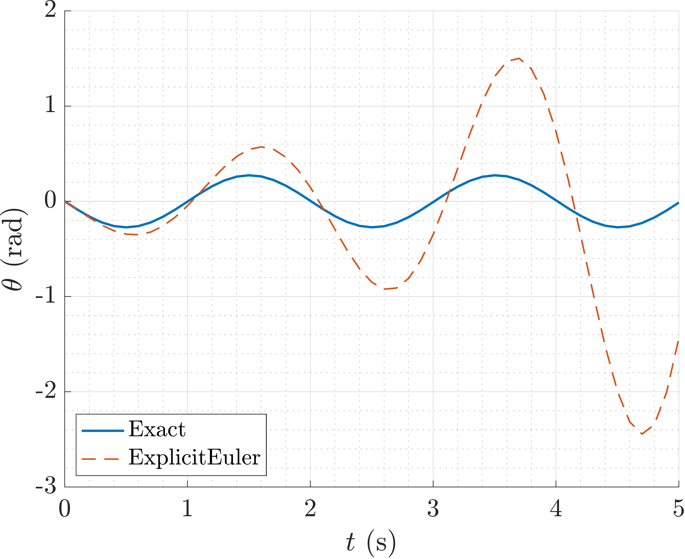
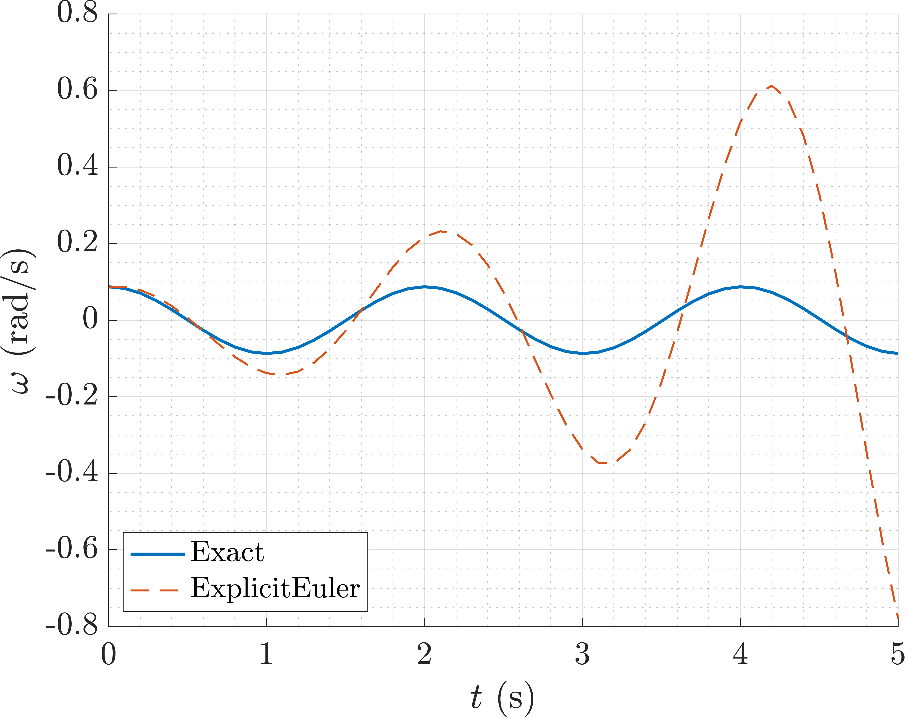

Linear Pendulum (ODE)
=====================

.. image:: images/simple-pendulum.svg
    :align: center
    :width: 25%

Load ODE
--------

Consider the ODE:

.. math::

  \begin{cases}
     \theta' - \omega = 0 & \\
     \omega' - \displaystyle\frac{g}{\ell}\sin\theta = 0 &
  \end{cases}

Define the class for the ODE to be integrated. In this case the class
``LinearPendulumODE`` derived from the base class ``ODEsystem``. The following
code is the contents of the file `LinearPendulumODE.m` cleared of comments and
unnecessary lines:

.. code-block:: none

  classdef LinearPendulumODE < ODEsystem
    %
    properties (SetAccess = protected, Hidden = true)
      m_m; % Pendulum mass (kg)
      m_l; % Pendulum length (m)
      m_g; % Gravity acceleration (m/s^2)
    end
    %
    methods
      %
      % - - - - - - - - - - - - - - - - - - - - - - - - - - - - - - - - - - - - -
      %
      function this = LinearPendulumODE( m, l, g )

        CMD = 'LinearPendulumODE::LinearPendulumODE(...): ';

        % Set the number of equations and the number of invariants
        num_eqns = 2;
        num_invs = 0;

        % Call the superclass constructor
        this@ODEsystem( 'LinearPendulumODE', num_eqns, num_invs );

        % Check the input arguments
        assert(m > 0, ...
          [CMD, 'pendulum mass must be positive.']);
        assert(l > 0, ...
          [CMD, 'pendulum length must be positive.']);
        assert(g > 0, ...
          [CMD, 'gravity acceleration must be positive.']);

        this.m_m = m;
        this.m_l = l;
        this.m_g = g;
      end
      %
      % - - - - - - - - - - - - - - - - - - - - - - - - - - - - - - - - - - - - -
      %
      function out = F( this, x, x_dot, t )

        CMD = 'LinearPendulumODE::F(...): ';

        % Check the input arguments
        assert(length(x) == this.m_num_eqns, ...
          [CMD, 'invalid x vector length.']);
        assert(length(x_dot) == this.m_num_eqns, ...
          [CMD, 'invalid x_dot vector length.']);
        assert(isnumeric(t), ...
          [CMD, 'invalid t vector.']);

        % Evaluate the system of ODEs
        out    = zeros(2,1);
        out(1) = x_dot(1) - x(2);
        out(2) = x_dot(2) + this.m_g / this.m_l * x(1);
      end
      %
      % - - - - - - - - - - - - - - - - - - - - - - - - - - - - - - - - - - - - -
      %
      function [JF_x, JF_x_dot] = JF( this, x, x_dot, t )

        CMD = 'LinearPendulumODE::JF(...): ';

        % Check the input arguments
        assert(length(x) == this.m_num_eqns, ...
          [CMD, 'invalid x vector length.']);
        assert(length(x_dot) == this.m_num_eqns, ...
          [CMD, 'invalid x_dot vector length.']);
        assert(isnumeric(t), ...
          [CMD, 'invalid t vector.']);

        % Evaluate the system of ODEs Jacobians
        JF_x      = zeros(2);
        JF_x_dot  = eye(2);
        JF_x(1,2) = -1.0;
        JF_x(2,1) = this.m_g / this.m_l;
      end
      %
      % - - - - - - - - - - - - - - - - - - - - - - - - - - - - - - - - - - - - -
      %
      function out = H( ~, ~, ~ )
        out = [];
      end
      %
      % - - - - - - - - - - - - - - - - - - - - - - - - - - - - - - - - - - - - -
      %
      function out = JH( ~, ~, ~ )
        out = [];
      end
      %
      % - - - - - - - - - - - - - - - - - - - - - - - - - - - - - - - - - - - - -
      %
      function out = exact( this, x_i, t )

        % Calculate temporary variables
        sqrt_t = sqrt(this.m_g/this.m_l);
        cos_t  = cos(sqrt_t.*t);
        sin_t  = sin(sqrt_t.*t);

        % Evaluate the exact solution
        out      = zeros(2,length(t));
        out(1,:) = -sqrt_t.*x_i(2).*sin_t + x_i(1).*cos_t;
        out(2,:) = sqrt_t.*(sqrt_t.*x_i(2).*cos_t - x_i(1).*sin_t);
      end
      %
      % - - - - - - - - - - - - - - - - - - - - - - - - - - - - - - - - - - - - -
      %
    end
    %
  end

Instantiate the ODE
-------------------

Having ``LinearPendulumODE.m`` now can instantiate the ``ODEsystem`` instance
with the desired parameters, *e.g.* mass, length, gravity:

.. code:: none

  % Load the linear pendulum model
  m = 1.0;  % Mass (kg)
  l = 1.0;  % Length (m)
  g = 9.81; % Gravity (m/s^2)
  ODE = LinearPendulumODE(m, l, g);

Choose solver
-------------

Choose ``ExplicitEuler`` as solver and attach the instantiated ``ODEsystem``
instance to it:

.. code:: none

  solver = ExplicitEuler(); % Initialize solver
  solver.set_ode(ODE);      % Attach ODE to the solver

Integrate
---------

Select the range and the desired sampling steps for the numerical solution:

.. code:: none

    d_t   = 0.05; % Desired time step (s)
    t_ini = 0.0;  % Initial time (s)
    t_end = 10.0; % Final time (s)
    T_vec = t_ini:d_t:t_end;

Setup the system of ODEs initial condition:

.. code:: none

  theta_0 = pi/6; % Initial angle (rad)
  omega_0 = 0;    % Initial angular velocity (rad/s)
  X_ini   = [theta_0; omega_0];

Compute numerical solution:

.. code:: none

  [X, T] = solver.solve(T_vec, X_ini);

Now the matrix ``X`` contain the solution of the system of ODEs at each time step
in the vector ``T``. The vector ``X`` is a matrix where the first column contains
\(\theta\), and the second column contains \(\omega\) values at each time step.
Notice that the vector ``T`` is not necessarily the same as ``T_vec`` since the
solver may choose to sample the solution at different time steps.

Extract solution
----------------

To extract the solution at each time step, use the following code:

.. code:: none

  time  = T;
  theta = X(1,:);
  omega = X(2,:);
  x =  l*sin(theta);
  y = -l*cos(theta);

this will give you the solution at each time step in the vectors ``time``,
``theta``, ``omega``, and the cartesian coordinates of the pendulum in the
vectors ``x``, and ``y``.

Plot the solution
-----------------

Plot the solution in the cartesian coordinates making them as fancy as you want.

  Plot of the angle \(\theta\) as a function of time.

  Plot of the angular velocity \(\omega\) as a function of time.
