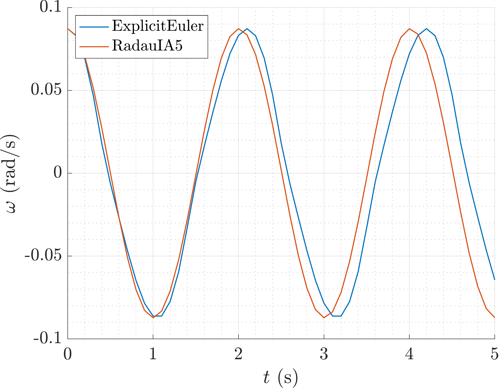

Pendulum (ODE)
==============

Load ODE
--------

Consider the ODE:

.. math::

  \begin{cases}
     \theta' - \omega = 0 & \\
     \omega' - \dfrac{g}{\ell}\sin(\theta) = 0 &
  \end{cases}

Define the class for the ODE to be integrated. In this case the class
``PendulumODE`` derived from the base class ``ODEsystem``. The following code is
the contents of the file `PendulumODE.m` cleared of comments and unnecessary
lines:

.. code-block:: none

  % Class container for the pendulum
  classdef PendulumODE < ODEsystem
    %
    properties (SetAccess = protected, Hidden = true)
      m_m;   % Pendulum mass (kg)
      m_l;   % Pendulum length (m)
      m_g;   % Gravity acceleration (m/s^2)
      m_X_0; % Initial conditions
    end
    %
    methods
      %
      % - - - - - - - - - - - - - - - - - - - - - - - - - - - - - - - - - - -
      %
      function this = PendulumODE( m, l, g, X_0 )

        CMD = 'PendulumODE::PendulumODE(...): ';

        % Set the number of equations and the number of invariants
        num_eqns = 2;
        num_invs = 1;

        % Call the superclass constructor
        this@ODEsystem('PendulumODE', num_eqns, num_invs);

        % Check the input arguments
        assert(m > 0, ...
          [CMD, 'pendulum mass must be positive.']);
        assert(l > 0, ...
          [CMD, 'pendulum length must be positive.']);
        assert(g > 0, ...
          [CMD, 'gravity acceleration must be positive.']);
        assert(length(X_0) == 2, ...
          [CMD, 'initial conditions must be a 2-vector.']);

        this.m_m   = m;
        this.m_l   = l;
        this.m_g   = g;
        this.m_X_0 = X_0;
      end
      %
      % - - - - - - - - - - - - - - - - - - - - - - - - - - - - - - - - - - -
      %
      function out = F( this, x, x_dot, ~ )

        CMD = 'PendulumODE::F(...): ';

        % Check the input arguments
        assert(length(x) == this.m_num_eqns, ...
          [CMD, 'invalid x vector length.']);
        assert(length(x_dot) == this.m_num_eqns, ...
          [CMD, 'invalid x_dot vector length.']);

        % Evaluate the system
        out    = zeros(2,1);
        out(1) = x_dot(1) - x(2);
        out(2) = x_dot(2) + this.m_g / this.m_l * x(1);
      end
      %
      % - - - - - - - - - - - - - - - - - - - - - - - - - - - - - - - - - - -
      %
      function [JF_x, JF_x_dot] = JF( this, ~, ~, ~ )

        % Evaluate the system Jacobians
        JF_x      = zeros(2);
        JF_x_dot  = eye(2);
        JF_x(1,2) = -1.0;
        JF_x(2,1) = this.m_g / this.m_l;
      end
      %
      % - - - - - - - - - - - - - - - - - - - - - - - - - - - - - - - - - - -
      %
      function out = H( this, x, ~ )
        out = [];
      end
      %
      % - - - - - - - - - - - - - - - - - - - - - - - - - - - - - - - - - - -
      %
      function out = JH( this, x, ~ )
        out = [];
      end
      %
      % - - - - - - - - - - - - - - - - - - - - - - - - - - - - - - - - - - -
      %
    end
    %
  end

Instantiate the ODE
-------------------

Having ``PendulumODE.m`` now can instantiate a ``ODEsystem`` class instance with
the desired parameters, *e.g.* mass, length, gravity and initial conditions:

.. code:: none

    % Pendulum parameters
    m = 1.0;  % mass (kg)
    l = 1.0;  % length (m)
    g = 9.81; % gravity (m/s^2)

    % Initial conditions
    theta_0 = 5*pi/180;
    omega_0 = 0.0;
    X_0     = [theta_0, omega_0];

    ODE = PendulumODE(m, l, g, X_0);

Choose solver
-------------

Choose ``ExplicitEuler`` and  ``RadauIA5`` as solvers and attach the
instantiated ``ODEsystem`` to them:

.. code:: none

  solver1 = ExplicitEuler();
  solver2 = RadauIA5();
  solver1.set_ode(ODE);
  solver2.set_ode(ODE);

Integrate
---------

Select the range and the desired sampling steps for the numerical solution:

.. code:: none

    d_t   = 0.05; % Desired time step (s)
    t_ini = 0.0;  % Initial time (s)
    t_end = 10.0; % Final time (s)
    T_vec = t_ini:d_t:t_end;

Compute numerical solution using the ``solve`` method of the solvers:

.. code:: none

  [X1, T1] = solver1.solve(T_vec, X_0);
  [X2, T2] = solver2.solve(T_vec, X_0);

Now the matrices ``X`` contain the solution of the system of ODEs at each time
step in the vectors ``T``. The vectors ``X`` are matrices where the first row
contains :math:`\theta`, and the second row contains :math:`\omega` values at
each time step. Notice that the vectors ``T`` are not necessarily the same as
``T_vec`` since the solvers may choose to sample the solution at different time
steps.

Extract solution
----------------

To extract the solution at each time step, use the following code:

.. code:: none

  time  = T1;
  theta = X1(1,:);
  omega = X1(2,:);
  x     =  l*sin(theta);
  y     = -l*cos(theta);

this will give you the solution at each time step in the vectors ``time``,
``theta``, ``omega``, and the cartesian coordinates of the pendulum in the
vectors ``x``, and ``y``.

Plot the solution
-----------------

- **Plot of the angle** :math:`\theta(t)` **.**

- **Plot of the angular velocity** :math:`\omega(t)` **.**

.. image:: ./images/pendulum_omega.png
  :width: 80%
  :align: center

- **Plot of the energy** :math:`E(t)` **.**

.. image:: ./images/pendulum_energy.png
  :width: 80%
  :align: center

As we can notice the solution is drifting away from the exact solution. This is
due to the fact that when solving the system of ODEs we are using a numerical
method, and the numerical method is not exact. The numerical method is only
approximating the solution of the system of ODEs. The numerical error can be
controlled by choosing a smaller time step ``d_t`` or by using a more accurate
numerical method. In addition to that, the numerical error can be reduced by
enhancing the class ``PendulumODE`` with the invariants of the system of
ODEs, *e.g.* the energy of the system, which can be used to correct the numerical
solution at each time step.

Invariants and Projection
-------------------------

Invariants are quantities that are conserved in the system of ODEs. In the case
of the linear pendulum, the energy of the system is conserved. The energy (or
invariant) of the system is given by:

.. math::

  \mathbf{H}(\mathbf{x}, t) =  mgl(\cos(\theta_0)-\cos(\theta)) +
    \frac{1}{2}ml^2(\omega)^2

Its derivative with respect to the states of the system is the invariant of the
system:

.. math::

  \mathbf{JH}_{\mathbf{x}}(\mathbf{x}, t) = \left[
    mgl\sin(\theta-\theta_0), ~ ml^2\omega
  \right]

The energy of the system is a function of the state of the system, *i.e.* the
angle :math:`\theta` and the angular velocity :math:`\omega`. In order to use
the variation of energy of the system as an invariant, we need to define the
method ``H`` in the class ``PendulumODE`` to compute the invariant of the system
at each time step:

.. code:: none

  function out = H( this, x, ~ )

    CMD = 'PendulumODE::H(...): ';

    % Check the input arguments
    assert(size(x,1) == this.m_num_eqns, ...
      [CMD, 'invalid x vector length.']);

    % Evaluate the system invariant
    out = this.m_m.*this.m_g.*this.m_l.*(cos(this.m_X_0(1))-cos(x(1,:))) + ...
          0.5.*this.m_m.*this.m_l^2.*(x(2,:)).^2;
  end

and to compute its derivative with respect to the states of the system to obtain
the method ``JH``:

.. code:: none

  function out = JH( this, x, ~ )

    CMD = 'PendulumODE::JH(...): ';

    % Check the input arguments
    assert(size(x,1) == this.m_num_eqns, ...
      [CMD, 'invalid x vector length.']);

    % Evaluate the system gradient of the invariant
    out = [this.m_m.*this.m_g.*this.m_l.*sin(x(1,:)), ...
          this.m_m.*this.m_l^2.*x(2,:)];
  end

Now we can use the variation of the system energy as an invariant to correct the
numerical solution at each time step. To do so, we enable the projection in the
solution process:

.. code:: none

  [X, T] = solver.solve(T_vec, X_0, true);

The plots of the angle and the angular velocity are now much better even with a
simple numerical method like ``ExplicitEuler``:

- **Plot of the projected angle** :math:`\theta(t)` **.**

.. image:: ./images/pendulum_theta_proj.png
  :width: 80%
  :align: center

- **Plot of the projected angular velocity** :math:`\omega(t)` **.**

- **Plot of the projected energy** :math:`E(t)` **.**

.. image:: ./images/pendulum_energy_proj.png
  :width: 80%
  :align: center

Note that also the natural frequency of the system is not matched by the
numerical solution of the ``ExplicitEuler`` method. To incresase the accuracy
of the numerical solution, we can use either a more accurate numerical method like
``RungeKutta4`` or a smaller time step ``d_t``.
