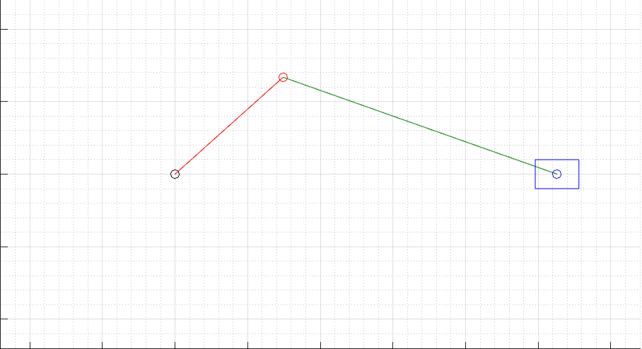

The DAE of a Slider Crank
=========================

In this example we will solve the DAE resulting from a dynamic analysis of the
slider crank mechanism. The figure below shows the mechanism.

We clarify that the even though we are solving a DAE, the library
integrates ODEs (hence all the names in the library refer to ODEs). To solve a
DAE we use a high order method and avoid reducing the index.

Problem statement
-----------------

Hereafter we provide a brief overview of the problem. For more details see the
file `SliderCrankDAE.mw`.

The first step is to perform the kinematic analysis of the mechanism. Using the
recursive formulation (mixed approach: relative coordinates + global angles), we
obtain the following constraint equations:

.. math::

  \begin{aligned}
    & -cos(\theta_1(t)) L1 - 2 L1 cos(\theta_2(t)) + s(t) = 0 \\[0.2em]
    & -L1 (sin(\theta_1(t)) + 2 sin(\theta_2(t))) = 0
  \end{aligned}

where :math:`\theta_1(t)` and :math:`\theta_2(t)` are the angles of the crank
and the shaft, respectively, and :math:`s(t)` is the position of the slider. We
have chosen :math:`\theta_1(t)` as the independent coordinate, whilst
:math:`\theta_2(t)` and :math:`s(t)` are the dependent coordinates.

The next step is the position and velocity analysis, which can be easily
performed by solving the system of constraint equations and their time
derivatives. The resulting equations are:

.. math::

  \begin{aligned}
    \theta_2(t) &= -arcsin(\frac{sin(\theta_1(t))}{2}) \\[0.2em]
    s(t) &= L1 (cos(\theta_1(t)) + sqrt(3 + cos(\theta_1(t))^2)) \\[0.2em]
    \dot{\theta_2(t)} &= -\frac{\dot{\theta_1(t)} cos(\theta_1(t))}{(2 cos(\theta_2(t)))} \\[0.2em]
    \dot{s(t)} &= \frac{L1 \dot{\theta_1(t)} (sin(\theta_2(t)) cos(\theta_1(t)) - cos(\theta_2(t)) sin(\theta_1(t)))}{cos(\theta_2(t))}
  \end{aligned}

Now that we completed the kinematic analysis, we can proceed to the dynamic
analysis. We perform the dynamic analysis using the Lagrange approach, obtaining
the following DAE:

.. math::

  \begin{aligned}
    & 2 \ddot{\theta_2(t)} L_1^2 m_1 cos(-\theta_2(t) + \theta_1(t)) + 2 \dot{\theta_2(t)}^2 L_1^2 m_1 sin(-\theta_2(t) + \theta_1(t)) + \frac{(7 L_1^2 m_1 \ddot{\theta_1(t)})}{3} + \frac{5 (g m_1 - \frac{(2 \lambda_2(t))}{5}) L_1 cos(\theta_1(t))}{2} + sin(\theta_1(t)) L_1 \lambda_1(t) + Ta = 0 \\[0.2em]
    & 2 (m_1 L_1 \ddot{\theta_1(t)} cos(-\theta_2(t) + \theta_1(t)) - m_1 \dot{\theta_1(t)}^2 L_1 sin(-\theta_2(t) + \theta_1(t)) + \frac{4 \ddot{\theta_2(t)} L_1 m_1}{3} + (g m_1 - \lambda_2(t)) cos(\theta_2(t)) + sin(\theta_2(t)) \lambda_1(t)) L_1 = 0 \\[0.2em]
    & 3 \ddot{s(t)} m_1 + \lambda_1(t) + Fa(s(t)) = 0 \\[0.2em]
    & -cos(\theta_1(t)) L_1 - 2 L_1 cos(\theta_2(t)) + s(t) = 0 \\[0.2em]
    & -L_1 (sin(\theta_1(t)) + 2 sin(\= 0 theta_2(t)))
  \end{aligned}

where we assumed:

.. math::

  \begin{aligned}
    L_2 &= 2 L_1 \\[0.2em]
    m_3 &= 3 m_1 \\[0.2em]
    m_2 &= 2 m_1 \\[0.2em]
    iz_1 &= \frac{1}{12} L_1^2 m_1 \\[0.2em]
    iz_2 &= \frac{2}{3} L_1^2 m_1 \\[0.2em]
    iz_3 &= 0
  \end{aligned}

in which :math:`L_1` is the length of the crank, :math:`m_1` is the mass of the
crank, :math:`g` is the gravitational acceleration, :math:`\lambda_1(t)` and
:math:`\lambda_2(t)` are the Lagrange multipliers associated with the
constraint equations. In addition, we assumed to have the crank actuated by a
torque :math:`Ta` and the slider to overcome a force :math:`Fa(s(t))`. The force
can be define at will, in this case we have chosen:

.. math::

  Fa(s(t)) = \begin{cases}
    Fa (s - 2.5) ^ 2 & \text{if } s(t) \leq 2.5 \\[0.2em]
    0 & \text{otherwise}
  \end{cases}

where :math:`Fa` is a constant.

A feasible set of initial conditions can be obtained by solving the system of
constraint equations and their time derivatives at :math:`t=0`:

.. math::

  \begin{cases}
     \theta_1(0) &= \frac{1}{3} \pi \\[0.2em]
     \dot{\theta_1}(0) &= 0 \\[0.2em]
     \theta_2(0) &= -arcsin(\frac{1}{4} \sqrt{3}) \\[0.2em]
     s(0) &= \frac{1}{2} L1 (1 + \sqrt{13}) \\[0.2em]
     \dot{theta_2}(0) &= 0 \\[0.2em]
     \dot{s}(0) &= 0
  \end{cases}

The initial conditions are for the Lagrange multipliers can be obtained from
DAE transformed into an ODE:

.. math::

  \begin{cases}
     \lambda_1(0) &= \frac{-0.4006907142 L_1 Fa(\frac{1}{2} L_1 (1 + \sqrt{13})) - 0.4063232683 L_1 g m_1 - 0.5417643578 Ta}{L_1}
     \lambda_2(0) &= \frac{1.235140062 L_1 g m_1 + 0.1335630204 L_1 Fa(\frac{1}{2} L1 (1 + \sqrt{13})) + 0.3135200802 Ta}{L_1}
  \end{cases}

Load the DAE
------------

Consider the implicit DAE defined in the previous section and define the
class for the DAE to be integrated in the file `SliderCrankDAE.m`. Notice that
the class ``SliderCrankDAE`` is derived from the base class ``ODEsystem``. The
content of the file `SliderCrankDAE.m`, will contain the methods ``F`` and
``JF`` for the evaluation of the DAE and its Jacobian matrices with respect
to the state variables and their derivatives, respectively.

For more details on the implementation of the class ``SliderCrankDAE`` please
refer to the file `SliderCrankDAE.m`.

Instantiate the DAE
-------------------

Having ``SliderCrankDAE.m`` we can now instantiate an ``ODEsystem`` class
instance with the desired parameters, *e.g.,* the gravitational constant, the
mass of the crank, the crank length, the actuation torque and the force:

.. code:: none

  g   = 9.81; % gravitational constant (m/s^2)
  m   = 1.0;  % crank mass (kg)
  l   = 1.0;  % crank length (m)
  Fa  = 10.0; % force (N)
  Ta  = 10.0; % torque (Nm)
  DAE = SliderCrankDAE(G, m_1, m_2, m_3);

Choose solver
-------------

Choose a suitable solver for the DAE system. In this example we will use the
``ImplicitEuler`` solver. Afterwards, attach the ODE system to the solver by
calling the method ``set_ode`` method of the solver class:

.. code:: none

  solver = ImplicitEuler(); % Initialize solver
  solver.setODE(ODE);       % Attach ODE to the solver

Integrate
---------

Select the range and the desired sampling steps for the numerical solution:

.. code:: none

  d_t   = 0.05;
  t_ini = 0.0;
  t_end = 10.0;
  T_vec = t_ini:d_t:t_end;

For the initial condition we will use the initial condition computed by the file
`initial_conditions.m`.

Finally, we can integrate the ODE system by calling the method ``solve`` of the
solver class:

.. code:: none

  [X, T] = solver.solve(T_vec, X_ini);

Now the matrix ``X`` contain the solution of the DAE at each time step in the
vector ``T``.

Plot solution
-------------

Finally, we can plot the solution of the DAE. For more details on the plotting
of the solution, please refer to MATLAB file `SliderCrankDAE_Run.m`.

.. image:: ./images/test1_theta.png
  :width: 80%
  :align: center

